# ZJU-blockchain-course-2022


## 如何运行

1. 在本地启动ganache应用。

2. 在 `./contracts` 中安装需要的依赖，运行如下的命令：
    ```bash
    npm install
    ```
3. 在 `./contracts` 中编译合约，运行如下的命令：
    ```bash
    npx hardhat compile
    ```
4. 在 `./contracts` 中部署合约，获取地址：
    ```bash
    npx hardhat run ./scripts/deploy.ts --network ganache
    ```
5. 将获取的合约地址分别复制到`lottery-frontend\src\utils\contract-addresses.json`中
6. 在 `./frontend` 中启动前端程序，运行如下的命令：
    ```bash
    npm run start
    ```

## 功能实现分析

#### 1.连接到metamask账户
    参照彩票系统demo连接metamask账户，是根据ganache搭建的测试网内地址
#### 2.给metamask账户空投代币
    引入ERC20协议，委托转账，给新账户空投100代币，账户不能多次领取
#### 3.使用代币提交提案
    提交提案时，触发绑定在按钮上的函数，使用ERC20委托转账，扣除账户3枚代币，并新建一个proposal结构体，这里为了方便测试，将提案的持续时间固定为20s
#### 4.花费代币赞同一个提议
    赞同提案时，触发绑定在按钮上的函数，使用ERC20委托转账，扣除账户2枚代币，改变结构体中的赞同计数变量，并刷新到页面上
#### 5.花费代币反对一个提议
    与赞同提案类似
#### 6.结束一个提议
    只有当提案持续时间结束后，才能成功结束提案。结束提案时，首先判断提案持续时间是否结束，再判断这个提案是否通过，如果赞同计数变量大于反对，则给提案提出者转账5代币

## 项目运行截图
部署合约
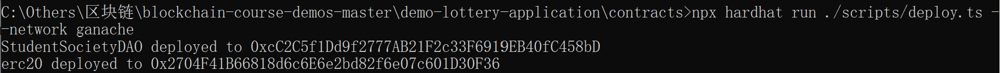
设置合约地址
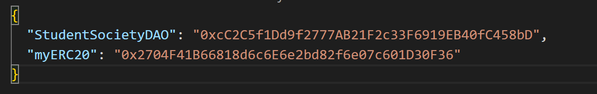
运行前端
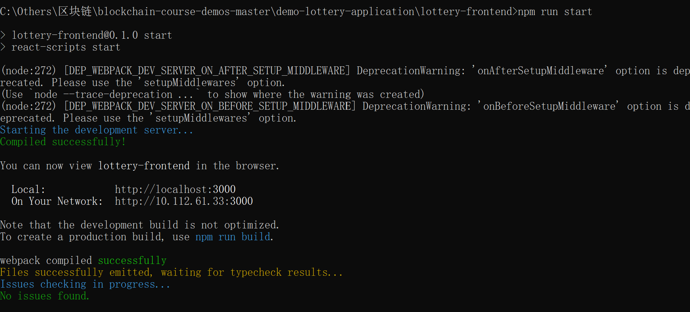
前端界面
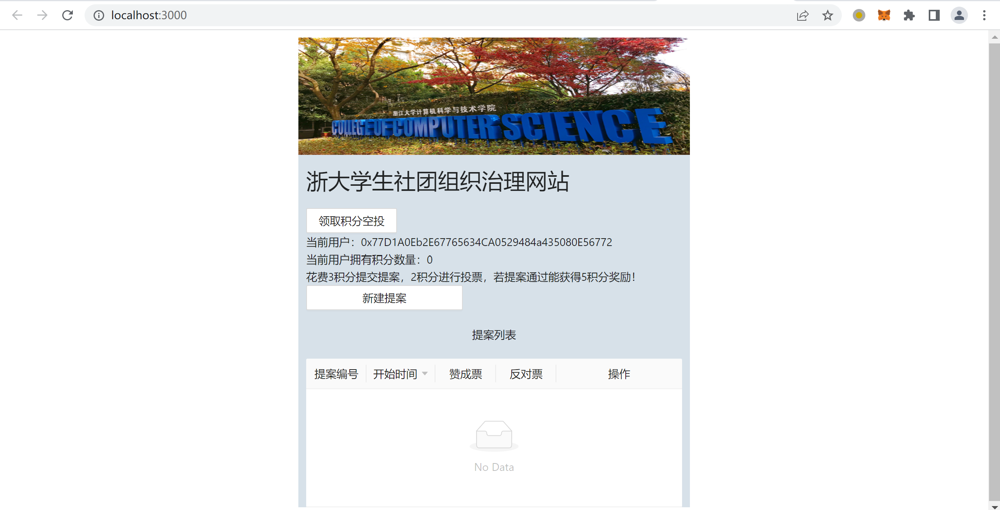
领取空投后（100代币）
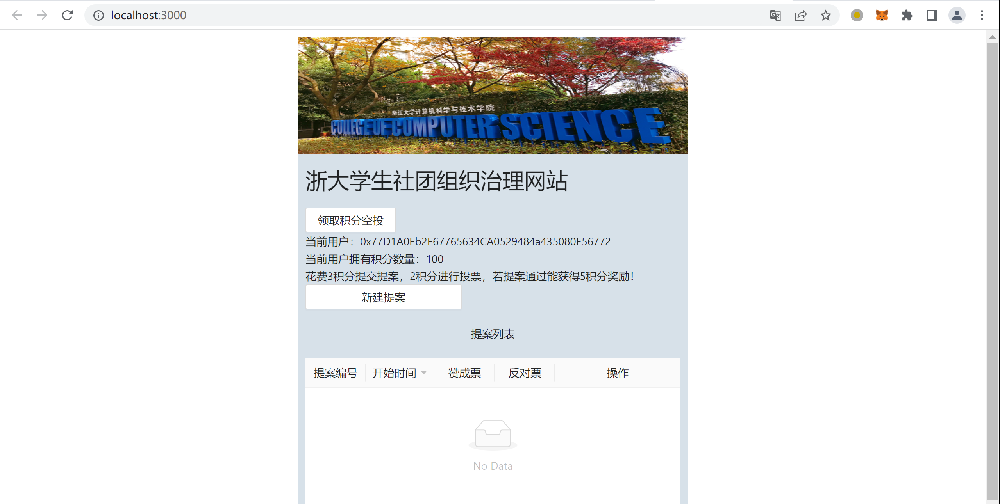
新建第一个提案（97代币）
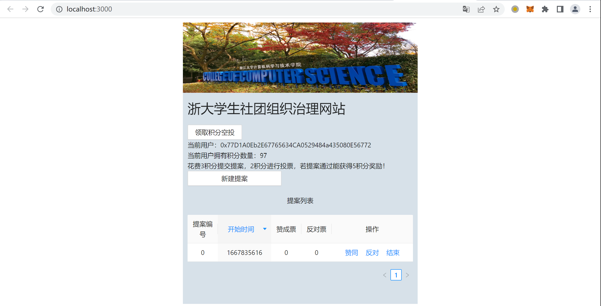
赞同第一个提案（95代币）
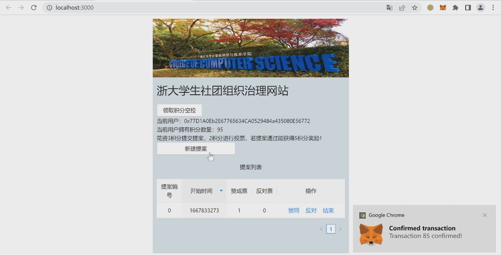
新建第二个提案（92代币）
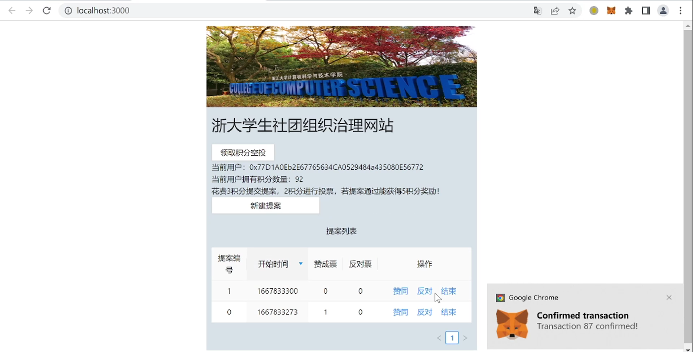
反对第二个提案（90代币）
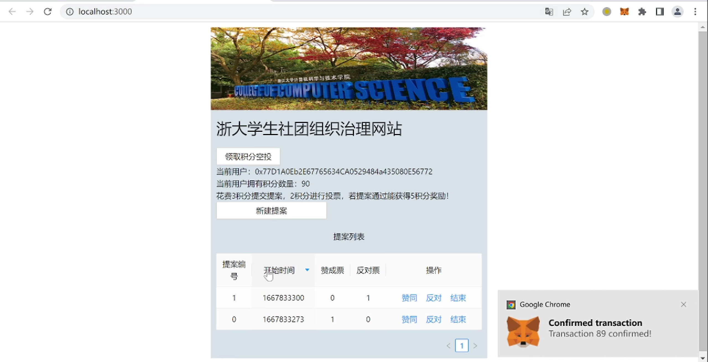
结束第一个提案（95代币）
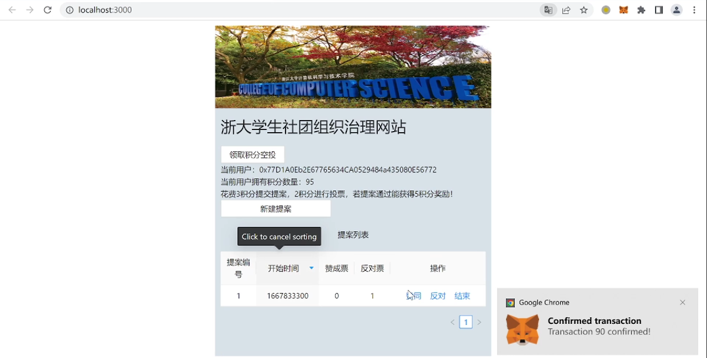
结束第二个提案（95代币）
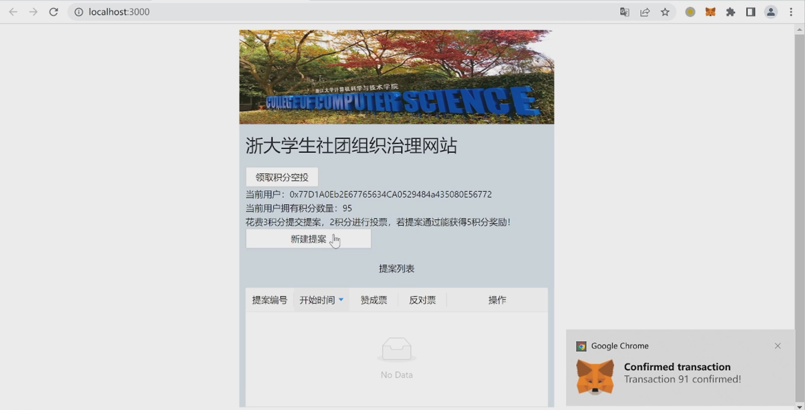

## 参考内容

课程的参考Demo见：[DEMOs](https://github.com/LBruyne/blockchain-course-demos)。
